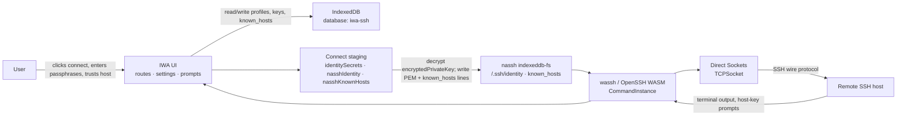

# Security

iwa-ssh is a **high-trust IWA** — packaged, signed, isolated. Security choices below are intentional for personal SSH use on ChromeOS.

## Threat model

### Assets

| Asset | Where it lives | What compromise means |
|-------|----------------|------------------------|
| **SSH private keys** | `encryptedPrivateKey` blobs in IndexedDB (`identities` store); decrypted PEM briefly staged in nassh FS at connect | Attacker can authenticate as you to any host that trusts the key |
| **Storage passphrase** | Prompted at connect; cached in memory only (`IdentityPassphrase.ts`) | Attacker can decrypt all WebCrypto-wrapped identities for the session |
| **OpenSSH key passphrase** | Prompted via `SecureInputPrompt` at connect for `opensshKeyEncrypted` keys; never stored | Attacker can use that specific key for the session |
| **Host trust** | `KnownHost` records in IndexedDB; mirrored to `/.ssh/known_hosts` in nassh FS before connect | Attacker can MITM SSH if user accepts a wrong fingerprint |
| **Session data** | Terminal I/O in memory; SSH wire traffic over Direct Sockets | Attacker on the path or a malicious server sees or injects session content |
| **Profiles & settings** | IndexedDB (`profiles`, `settings`) | Leaks hostnames, usernames, and connection habits — not key material |

### Attackers and scenarios

| Threat | Example | Mitigations in this app |
|--------|---------|-------------------------|
| **Malicious SSH server** | Fake `known_hosts` prompt, terminal phishing, exfil via shell | Host-key prompt (`HostKeyGuard` + `KnownHostPrompt`); user must explicitly trust; no auto-connect |
| **Network MITM** | TLS downgrade N/A (raw SSH); substitute host key | SSH host-key verification; user confirmation on unknown/changed keys |
| **Compromised supply chain** | Tampered `.swbn`, stolen signing key, malicious upstream submodule | Signed Web Bundle; all JS/WASM ships in-bundle; no runtime CDN scripts; verify signing key out-of-band |
| **Malicious page in same browser** | Steal keys from another origin | IWA `isolated-app://` origin — separate from normal profile storage and sites |
| **Local attacker with device access** | Read IndexedDB, memory dump, swap | WebCrypto at rest; passphrases not persisted; **not** a hardened HSM — physical access is largely out of scope |
| **Weak user choices** | Reused storage passphrase, clicking “trust” on wrong fingerprint | Documented expectations; no silent trust |

### What IWA isolation protects

- **Origin isolation** — App data (`iwa-ssh` IndexedDB, nassh `indexeddb-fs`) is not readable by arbitrary `https://` pages or other extensions.
- **Bundle integrity** — Production installs load only code from the signed `.swbn`; CSP blocks inline scripts and remote script loads.
- **Cross-origin isolation** — COOP/COEP/CORP headers enable a locked-down execution environment suitable for WASM SSH.
- **No extension relay** — TCP goes through Direct Sockets in-process; there is no NaCl/background-relay hop that another extension could impersonate.
- **Explicit connect** — No background connections, LAN scanning, or silent auth.

### What IWA isolation does **not** protect

- **A server you connect to** — Once authenticated, the remote host has full shell access; a malicious server can phish inside the terminal or abuse your account on that machine.
- **User-approved bad trust** — If you confirm a wrong host key, SSH will encrypt traffic to the attacker.
- **Weak or reused passphrases** — `KeyCrypto.ts` uses PBKDF2 (310k iterations) + AES-GCM, but offline guessing is still possible if the passphrase is weak.
- **Plaintext key staging** — At connect time, decrypted PEM bytes are written to nassh’s virtual FS (`/.ssh/identity/…`) for `ssh -i`; they exist in memory and in nassh’s IndexedDB-backed FS until overwritten.
- **Session passphrase cache** — Storage passphrases stay in a JS `Map` until the tab/session ends; a compromised renderer could read them.
- **Dev Mode Proxy installs** — Random bundle ID, no meaningful signing story; treat like a normal browser tab for threat modeling.
- **Signed malicious updates** — If the signing key is compromised or you install an attacker-built `.swbn`, isolation cannot help.

## Trust boundaries

Data and trust flow across these layers. Each boundary is a place where secrets are decrypted, copied, or sent over the network.



**Boundary notes:**

1. **User → UI** — All auth and trust decisions are explicit (connect button, storage passphrase, host-trust modal, `SecureInputPrompt` for OpenSSH-encrypted keys).
2. **UI → IndexedDB** — Private keys are stored as `encryptedPrivateKey` (WebCrypto blob). Export JSON omits key bytes (`hasEncryptedPrivateKey` / `hasLegacyPlaintextKey` flags only).
3. **IndexedDB → nassh FS** — On connect, `stageIdentityForNassh` decrypts and writes PEM to `/.ssh/identity/iwa-ssh-{id}`; `stageKnownHostsForNassh` writes `/.ssh/known_hosts`. This is a **plaintext staging step** inside the IWA origin.
4. **nassh FS → wassh** — Upstream `CommandInstance` runs OpenSSH in WASM with `--field-trial-direct-sockets`. `nasshChromePolyfill.ts` stubs `chrome.*` but deliberately leaves `chrome.sockets` unset so wassh uses Direct Sockets.
5. **wassh → Direct Sockets → remote** — Raw TCP to the profile’s declared `host:port` only; no relay fallback in this fork.

## Credentials

| Rule | Implementation |
|------|----------------|
| **No plaintext passwords** | Key-based auth only; no password field in profiles or storage |
| **Encrypted private keys** | AES-GCM + PBKDF2 (310k iterations) via `app/src/security/KeyCrypto.ts` |
| **No silent auth** | Connecting requires explicit user action (connect button / profile select) |

Passphrase is never written to IndexedDB or export JSON.

### Implemented (MVP)

- **Key import UI** (`app/src/ssh/KeyImport.ts`): OpenSSH private key PEM via file or paste; encrypted at rest with a user-chosen **storage passphrase** into `encryptedPrivateKey`.
- **Identity picker** on connect and profile editor with import button.
- **Storage passphrase prompt** at connect time (`identitySecrets.ts`); cached in memory for the session only (`IdentityPassphrase.ts`).
- **OpenSSH-encrypted PEM keys**: imported with `opensshKeyEncrypted: true`; the PEM file’s internal encryption is preserved inside the WebCrypto blob; wassh prompts for the **key passphrase** via `SecureInputPrompt` at connect time.
- **No password fields** anywhere in the UI or storage layer.

### Primary storage: `encryptedPrivateKey`

New imports always use `Identity.encryptedPrivateKey` — a versioned blob (`format 1 | salt | iv | ciphertext`). `identityUsesStorageEncryption()` and `identityHasPrivateKey()` treat this as the normal path.

### Legacy: `privateKeyPemBytesDevOnly`

`Identity.privateKeyPemBytesDevOnly` is **deprecated** plaintext PEM retained only for identities imported before WebCrypto landed. On read, `identityNormalize.ts` migrates mistaken plaintext rows that were stored in `encryptedPrivateKey` into `privateKeyPemBytesDevOnly`. Settings labels these as “legacy plaintext”; re-import with a storage passphrase to upgrade.

## Host trust

| Rule | Implementation |
|------|----------------|
| **known_hosts store** | `KnownHost` records in IndexedDB (`host:port` → fingerprint) |
| **Trust prompt** | Unknown/changed host keys require user confirmation before connect |
| **No LAN scanning** | No discovery, broadcast, or background connection attempts |

### Implemented (MVP)

- **Trust modal** (`app/src/ssh/KnownHostPrompt.ts`): UI for host trust decisions.
- **HostKeyGuard** (`app/src/ssh/HostKeyGuard.ts`): intercepts OpenSSH fingerprint prompts during live SSH; sends `yes`/`no` after user choice.
- **known_hosts sync** (`app/src/ssh/nasshKnownHosts.ts`): stages trusted lines into nassh FS before connect; syncs back after `Permanently added …`.
- **Connect gate** (`app/src/routes/connect.ts`): stub prompt only when upstream assets are missing.
- **Settings UI**: list and remove trusted hosts and SSH identities.
- **Debug inspector** (`/debug`): read-only diagnostics for runtime capabilities and upstream assets.

### Dev-only / echo stub

- Pre-connect stub prompt when upstream wassh is unavailable (`SHA256:STUB-…` fingerprints).
- **Session reconnect** does not re-prompt for host trust (checked at connect-screen submit in stub mode only).
- **Removing or editing** known host entries: remove via Settings; no inline edit yet.

## Network

| Rule | Implementation |
|------|----------------|
| **Direct TCP only (MVP)** | `TCPSocket` via Direct Sockets; no relay/proxy fallback |
| **User-initiated** | No connections without explicit connect action |
| **SSH to declared host:port** | Profile stores target; no redirect to arbitrary endpoints |

SSH traffic uses upstream wassh via nassh `CommandInstance` (`--field-trial-direct-sockets`). `DirectSocketProbe.ts` is for capability checks only (e.g. `/debug`). `nasshChromePolyfill.ts` does not implement `chrome.sockets` — wassh must use Direct Sockets.

## Clipboard images and SFTP sidecars

- Clipboard access occurs only after the user invokes a paste action. Raster
  media is restricted to PNG, JPEG, WebP, and GIF and rejected above 25 MiB.
- Inline paste decodes the first image frame to PNG and feeds quiet direct
  Kitty packets only to the focused Restty output callback. It never traverses
  a transport or enters the remote shell's stdin.
- Upload paste opens a separate nassh SFTP subsystem connection to the exact
  profile SSH host and port. It reuses identity staging, known-host state, live
  host-key confirmation, and secure-input UI; it does not weaken SSH trust.
- Original bytes are written with `0600` permissions under
  `~/.cache/iwa-ssh/pastes/` through an exclusive `.part` name and atomic
  rename. Cancellation and failure remove the partial file best-effort.
- Cleanup considers only randomized `iwa-paste-*` files owned by this feature
  and older than seven days. Cleanup failure does not broaden deletion or block
  a new upload. Remote files remain exposed to the security boundary of the
  remote Unix account until deleted.

## Content Security Policy

IWA bundles enforce strict CSP (set via bundle `headerOverride` in `iwa/webbundle.config.ts`):

```text
base-uri 'none'
default-src 'self'
object-src 'none'
frame-src 'self' https: blob: data:
connect-src 'self' https: wss: blob: data:
script-src 'self' 'wasm-unsafe-eval'
img-src 'self' https: blob: data:
media-src 'self' https: blob: data:
font-src 'self' blob: data:
style-src 'self' 'unsafe-inline'
require-trusted-types-for 'script'
trusted-types default
```

The bundle declares `require-trusted-types-for 'script'` (the directive that actually enables Trusted Types enforcement, which Chrome requires on IWAs) together with `trusted-types default` (the policy allowlist). The app registers a **default** Trusted Types policy in `app/src/security/trustedTypes.ts` before any `innerHTML` rendering so the shell can boot.

This policy mirrors Chrome's required IWA baseline verbatim. Chrome **injects** the required CSP onto every resource served from the bundle; any policy the bundle declares is enforced *in addition* (policies combine as an intersection), so this header cannot relax the baseline — it can only match it or tighten it. In particular `font-src` is `'self' blob: data:` (no `https:`): **remote `@font-face` fonts cannot load in an IWA**.

The terminal therefore never relies on `@font-face` for the canvas: restty shapes from font **bytes**. Bundled fonts (`app/public/fonts/`) load by same-origin URL (`connect-src 'self'`); user-provided fonts are uploaded, or downloaded from a URL (the fetch uses `connect-src`, which allows `https:`), then cached in IndexedDB and handed to restty as a `buffer` source. None of these depend on `font-src`.

Cross-origin isolation headers:

```text
Cross-Origin-Opener-Policy: same-origin
Cross-Origin-Embedder-Policy: require-corp
Cross-Origin-Resource-Policy: same-origin
```

## Bundle integrity

| Rule | Notes |
|------|-------|
| **No remote scripts** | All JS/WASM/CSS/fonts ship inside the signed `.swbn` |
| **No CDN runtime deps** | xterm, app code bundled at build time |
| **Signed updates** | Optional via `iwa/update-manifest.json`; local-only installs use `.swbn` from disk without an update server |
| **Stable identity** | Web Bundle ID derived from signing key — rotate key = new app |

`'wasm-unsafe-eval'` is required for OpenSSH WASM (wassh). No `'unsafe-inline'` for scripts.

## Storage isolation

- IWA storage is separate from normal browser profile storage.
- Each Web Bundle ID gets its own `isolated-app://` origin.
- App state uses IndexedDB database `iwa-ssh` (`settings`, `profiles`, `identities`, `knownHosts`).
- nassh maintains a separate `indexeddb-fs` volume for `/.ssh/*` staging — still inside the same IWA origin, not shared with other apps.
- Export JSON omits private key bytes (`hasEncryptedPrivateKey` / `hasLegacyPlaintextKey` flags only).

## nassh extension vs iwa-ssh IWA

Both reuse Chromium **libapps** (nassh + wassh), but the packaging and platform APIs differ.

| | **Secure Shell (nassh) extension** | **iwa-ssh IWA** |
|---|----------------------------------|-----------------|
| **Origin** | `chrome-extension://{extension-id}/` | `isolated-app://{web-bundle-id}/` |
| **Distribution** | Chrome Web Store (Google-signed CRX) | Signed Web Bundle (`.swbn`); local install or optional update manifest |
| **Updates** | Web Store auto-update channel | Publisher-controlled signed bundles; `iwa/update-manifest.json` scaffold only |
| **TCP transport** | `chrome.sockets.tcp` in extension mode; Direct Sockets optional in PWA manifest | **Direct Sockets only** — `chrome.sockets` intentionally absent (`nasshChromePolyfill.ts`) |
| **Relay / proxy** | Optional NaCl/Google relay HTML for constrained networks | **No relay** — direct TCP or fail |
| **Storage** | `chrome.storage` + extension IndexedDB | IWA-isolated IndexedDB (`iwa-ssh` + nassh `indexeddb-fs`) |
| **Key storage** | Upstream nassh preferences / FS (varies by build) | WebCrypto `encryptedPrivateKey` in app IndexedDB; legacy `privateKeyPemBytesDevOnly` only for old imports |
| **CSP** | MV3 `extension_pages` CSP (`script-src 'self' 'wasm-unsafe-eval'`) | Full IWA CSP + Trusted Types + COOP/COEP/CORP (see above) |
| **Signing** | Web Store code signing | Ed25519 or ECDSA P-256 bundle signing key (`iwa/keys/encrypted_key.pem`) |
| **Permissions** | Broad extension APIs (`sockets`, `fileSystemProvider`, `terminalPrivate`, …) | IWA `permissions_policy`: `direct-sockets`, `cross-origin-isolated`, LAN keys per [IWA dev setup](./IWA_DEV_SETUP.md) |
| **Feature scope** | SFTP FSP, Mosh, port forwarding, agent forwarding, omnibox, … | Interactive SSH terminal only — see [Non-goals](#non-goals) |

## Dev mode caveats

IWA Dev Mode Proxy assigns a **random** bundle ID — fine for development, not for security testing of updates/signing.

Do not use dev proxy installs for secrets you would not put in a normal browser tab on an untrusted network.

## Non-goals

Explicitly out of scope for this fork (upstream nassh may support some of these):

| Non-goal | Notes |
|----------|-------|
| **Mosh** | UDP-based mobile shell; upstream WASM exists but not wired |
| **SFTP UI** | No file-system provider or nasftp integration |
| **Jump hosts / ProxyJump** | Single-hop SSH to profile `host:port` only |
| **SSH agent forwarding** | Not exposed in connect params or UI |
| **Port forwarding** | No local/remote/dynamic forwarding UI |
| **Password authentication** | Key-based auth only; no password fields |
| **Extension relay** | No `chrome.sockets`, no NaCl relay fallback |
| **Telemetry** | No crash reporting, analytics, or remote logging |
| **Automatic LAN trust** | No subnet scanning or “trust all RFC1918” shortcuts |

## Reporting

For upstream Secure Shell security issues, see [Chromium security](https://www.chromium.org/Home/chromium-security/). For this fork, use the project issue tracker.
